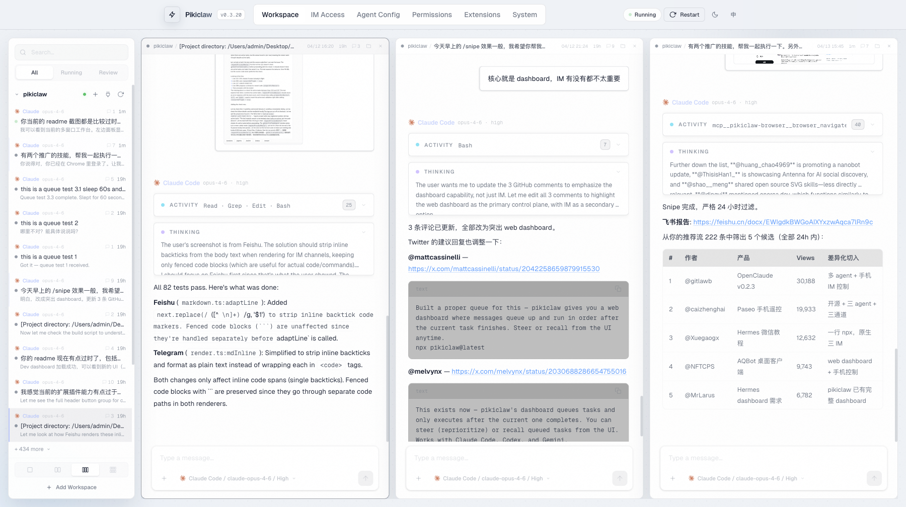
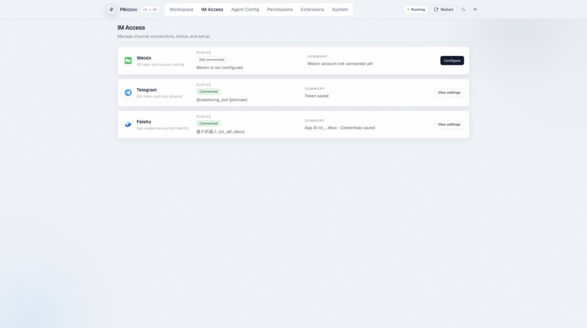
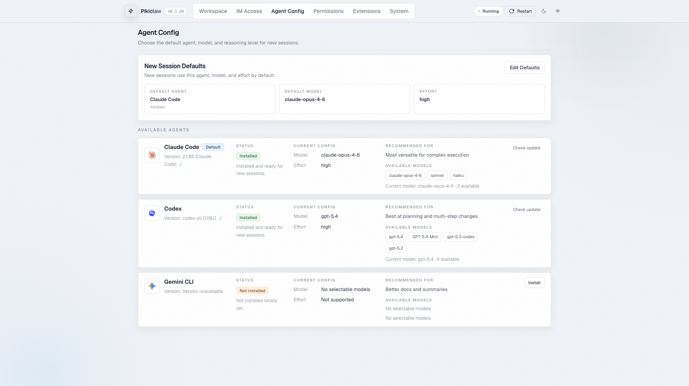
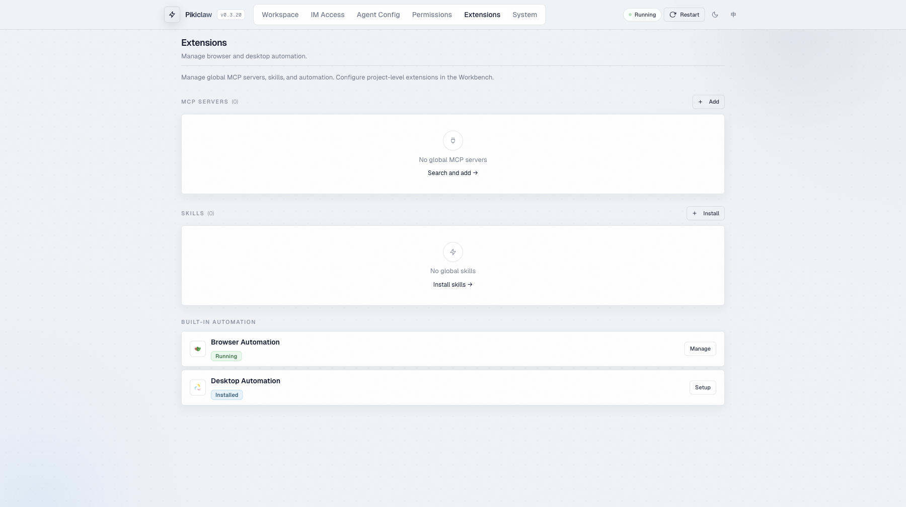
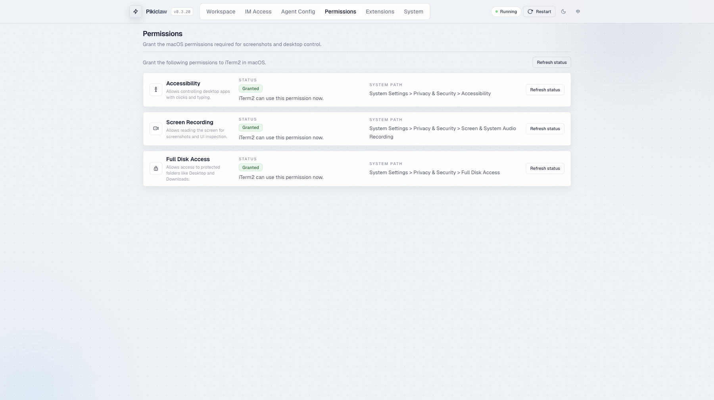
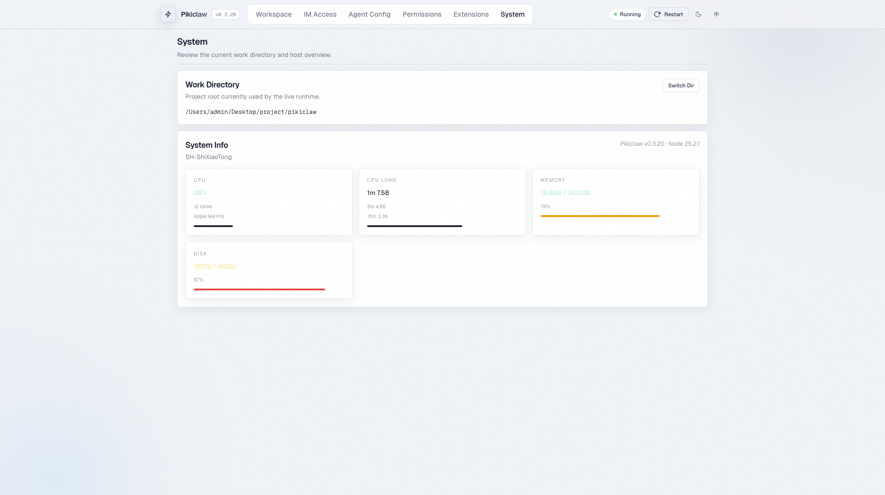
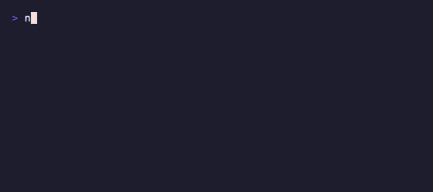
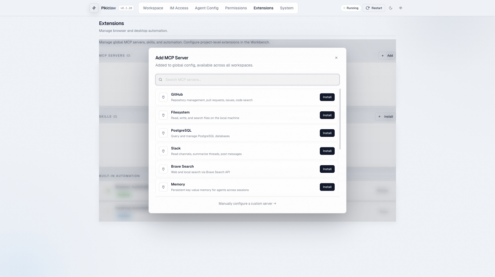

<div align="center">

# pikiclaw

## Put the world's smartest AI agents in your pocket.

##### *The open Agent orchestrator for the era when creators no longer need to read code.*

*Plug in any agent (Claude · Codex · Gemini · Hermes · …), any model (Claude · GPT · Gemini · DeepSeek · 豆包 · MiMo · MiniMax · OpenRouter · or any third-party proxy), any tool (Skills · MCP · CLI). Drive them from any terminal — IM, Web, or future. Pikiclaw is built using pikiclaw.*

```bash
npx pikiclaw@latest
```

<p>
<a href="https://www.npmjs.com/package/pikiclaw"></a>
<a href="https://www.npmjs.com/package/pikiclaw"></a>
<a href="https://github.com/xiaotonng/pikiclaw/stargazers"></a>
<a href="LICENSE"></a>
<a href="https://nodejs.org"></a>
</p>


</div>

---

## What is pikiclaw?

**Most "AI dev tool" projects pick one slice — one IDE, one agent, one model vendor — and stop there.** pikiclaw is built around a different bet: the next era of building does not happen inside a single editor. It happens through an **orchestrator** that lets a creator drive a *swarm* of agents — in parallel, from one console — on the best models, through whatever terminal is closest at hand. And never open a code file.

The product is the orchestrator. Everything else plugs in. **And the orchestrator is built using itself** — pikiclaw is what we use to build pikiclaw.

```
    Terminal layer       Telegram   Feishu   WeChat   Web Dashboard   ( …mobile · voice · future )
                              \__________________|__________________/
                                                 v
                                  ┌──────────────────────────────┐
                                  │     pikiclaw orchestrator    │
                                  └──────────────────────────────┘
                                                 |
                ┌────────────────────────────────┼────────────────────────────────┐
                v                                v                                v
         Agent layer                      Model layer                       Tool layer
   Claude Code · Codex · Gemini    Claude · GPT · Gemini · DeepSeek    Skills · MCP · CLI
   Hermes · …  (driver registry)   豆包 · MiMo · MiniMax · OpenRouter   (global × workspace)
                                   · any third-party proxy · …
                                                 |
                                                 v
                                          Your computer
```

- **Terminal layer** — Telegram, Feishu, WeChat, and the Web Dashboard are co-equal entry points. New terminals plug in here.
- **Agent layer** — Official Claude Code / Codex / Gemini CLIs as drivers. Hermes is next; the registry takes any agent.
- **Model layer** — Claude / GPT / Gemini, the domestic Chinese series (DeepSeek, 豆包, MiMo, MiniMax), plus OpenRouter and any third-party proxy. Wrappers let an agent run on top of arbitrary models.
- **Tool layer** — Skills, MCP servers, and CLI tools merged across global and workspace scopes, injected into every session.

---

## Built with itself

> The most credible test of an Agent orchestrator is whether it can build itself. pikiclaw can. We use pikiclaw to develop, test, release, and operate pikiclaw — every commit, every release.

A typical day-of-development inside pikiclaw:

- A Claude Code session in window 1 implements a new dashboard route.
- A Codex session in window 2 writes the matching unit tests, against the same workspace.
- A Gemini session in window 3 reviews the diff and drafts the changelog.
- A skill (`/sk_promote`) sweeps GitHub for relevant issues and replies in a fourth thread.
- All four streams run in parallel; one human steers them from a phone in a coffee shop.

The orchestrator is the product. It also happens to be the IDE the orchestrator is built in.

---

## A swarm by default

Most "AI dev tools" assume one user, one agent, one task at a time. pikiclaw assumes the opposite: **N agents, N windows, one operator, one toolkit.**

- **N parallel sessions** — every dashboard pane is an independent agent stream against an independent session workspace; IM threads add even more.
- **Mix-and-match agents** — Claude Code in pane 1, Codex in pane 2, Gemini in pane 3, all on different repos / workspaces.
- **One toolkit** — global skills, global MCP servers, and per-workspace overrides apply uniformly. You configure once; every session inherits.
- **Steer anywhere** — interrupt any running stream, queue a follow-up, hand control to the next agent in line.
- **Group-mode** — drop the orchestrator into a Feishu / WeChat group; teammates share the same swarm.

This is the shape that matters: one creator, with a swarm at their fingertips.

---

## See it in action

> **Real task** — ask pikiclaw to gather and summarize today's AI news; the agent reads, writes, and ships the result back through Telegram, all from your phone.

<p align="center"></p>

> **Web Dashboard** — multi-pane workspace with session list, conversation, tool-use traces, and input composer (1 / 2 / 3 / 6 pane layouts).

<p align="center"></p>

<details>
<summary><b>More: basic ops · IM access · agent config · extensions · permissions · system info</b></summary>

> Send a message, watch the agent stream, receive files back.


> **IM Access** — Telegram, Feishu, WeChat channel status and configuration



> **Agent Config** — default agent / model / reasoning effort, available agents overview



> **Extensions** — global MCP servers, community skills, browser & desktop automation



> **System Permissions** — macOS accessibility, screen recording, disk access



> **System Info** — working directory, CPU / memory / disk monitoring



</details>

---

## Quick start

**Prereqs:** Node.js 18+, plus at least one official Agent CLI logged in:

- [`claude`](https://docs.anthropic.com/en/docs/claude-code) (Claude Code)
- [`codex`](https://github.com/openai/codex) (Codex CLI)
- [`gemini`](https://github.com/google-gemini/gemini-cli) (Gemini CLI)

**Launch:**

```bash
cd your-workspace
npx pikiclaw@latest
```

<p align="center"></p>

That opens the **Web Dashboard** at `http://localhost:3939` — drive sessions in the browser, connect IM channels, configure agents/models, install MCP servers and skills, manage system permissions. Everything else is one click away.

<details>
<summary><b>Prefer the terminal? There's a wizard.</b></summary>

```bash
npx pikiclaw@latest --setup    # interactive terminal wizard
npx pikiclaw@latest --doctor   # environment check only
```

</details>

---

## What people do with it

- **Run a swarm in parallel** — open N sessions in N dashboard panes (or N IM threads), each a different agent on a different workspace, all working at the same time. One person, many agents, one cockpit. Steer any of them at any moment.
- **Self-hosted dev loop** — pikiclaw was built using pikiclaw. The dev workflow *is* the product: drive the orchestrator from your phone, write code, ship a release, iterate.
- **Walk-away coding** — kick off a long refactor, close the laptop, drive it from your phone over Telegram. The agent keeps running locally; results stream back to chat.
- **Multi-agent on one workspace** — let Claude Code draft an implementation, switch to Codex to review, then Gemini for a different perspective. Same files, same session history.
- **Domestic-model routing** — run Claude Code over DeepSeek or 豆包 via a wrapper driver when latency, cost, or compliance demands a non-frontier model.
- **Group-chat agent** — drop pikiclaw into a Feishu / WeChat work group; the team shares one orchestrator, one workspace, one set of skills.
- **Headless operator** — give the agent browser + macOS desktop control via the built-in MCP bridge, then steer it from anywhere — book a meeting, scrape a dashboard, run an end-to-end test.
- **Skill-driven workflows** — install community skills (`promote`, `snipe`, `review`, `security-review`, …) once and trigger them from any terminal with `/sk_<name>`.

---

## Features

### Terminal layer

- **Telegram, Feishu, WeChat** — run one or all simultaneously. Each channel is physically isolated; adding a new one (WhatsApp, mobile app, …) doesn't touch the others.
- **Web Dashboard** — drive sessions directly from the browser with the same conversation, tool-use, and streaming surfaces as IM. Multi-pane workspace (1 / 2 / 3 / 6 panes), light / dark theme, EN / 中文 i18n.
- **Live streaming preview** — message updates in place as the agent thinks; long text auto-splits; images and files stream back in real time.

### Agent layer

- **Official CLIs as drivers** — Claude Code, Codex CLI, Gemini CLI. No home-grown agent rewrite. You get the upstream behavior, on day-zero updates.
- **Pluggable registry** — `agent-driver.ts` is the only contract. Hermes and future agents drop in.
- **Per-session agent switching** — same workspace, swap the brain.
- **Steer** — interrupt a running task and let a queued message jump ahead in the queue.
- **Codex human-in-the-loop** — when Codex pauses to ask, the question becomes an interactive IM prompt. Reply there; the task continues.

### Model layer

- **Frontier + domestic + proxies** — Claude (4 family), GPT-5 / Codex, Gemini, DeepSeek, 豆包 (Doubao), MiMo, MiniMax, OpenRouter, and any third-party model proxy.
- **Per-session model + reasoning effort** — picked from the dashboard or `/models`.
- **Wrapper drivers** — run Claude Code or Codex on top of arbitrary models when the upstream client allows.

### Tool layer

- **Skills** — project skills in `.pikiclaw/skills/*/SKILL.md`, compatible with `.claude/commands/*.md`. One-click install from GitHub repos (`owner/repo`) or browse recommended packs (Anthropic Official, Vercel Agent Skills, …). Trigger with `/skills` and `/sk_<name>`.
- **MCP servers** — browse the [MCP Registry](https://registry.modelcontextprotocol.io), add custom stdio / HTTP servers, health-check with a real handshake, enable per scope. Built-ins include GitHub, Filesystem, PostgreSQL, Slack, Brave Search, Memory, Fetch, SQLite, Git, Sentry.
- **CLI tools** — invoked through the agent's normal tool surface, augmented by pikiclaw's session-scoped MCP bridge.
- **Two-scope merge** — `global < workspace < built-in`, applied automatically to every session.

<p align="center"></p>

### Runtime & DX

- **Session workspace** — every session owns a directory; file attachments land there automatically.
- **Resume, switch, classify** — multi-turn conversations, session classification (answer / proposal / implementation / blocked / …).
- **Session-scoped MCP bridge** — built-in `im_list_files` / `im_send_file` for streaming files back to chat.
- **GUI automation** (optional):
  - **Browser** — managed Chrome profile via `@playwright/mcp`; log in once, reuse credentials across tasks.
  - **Desktop (macOS)** — Appium Mac2 with `desktop_open_app`, `desktop_snapshot`, `desktop_click`, `desktop_type`, `desktop_screenshot`.
- **Long-task hardening** — sleep prevention, watchdog, auto-restart, daemon mode.

---

## How is this different?

| | pikiclaw | IDE assistants<br>(Cursor / Windsurf / Aider) | Cloud agents<br>(Devin / web Claude) | Single-agent IM bots |
|---|---|---|---|---|
| **Terminal** | IM + Web + future plug-ins | IDE only | Web app | One IM, one bot |
| **Where the agent runs** | Your machine | Your machine | Vendor sandbox | Often vendor |
| **Agent choice** | Claude Code · Codex · Gemini · Hermes · … | Bundled | Single | Single |
| **Model choice** | Frontier + domestic Chinese | Vendor-controlled | Vendor-controlled | Single |
| **Parallel agents** | **N agents × N windows × N workspaces** | One per IDE | Sequential | One |
| **Files / tools** | Your files, your MCP, your CLIs | Your files | Sandbox | None / limited |
| **Plug new terminal** | Add a `Channel` class | n/a | n/a | Fork |
| **Plug new agent** | Add an `AgentDriver` | n/a | n/a | Fork |
| **Self-bootstrapping** | **Yes — built with itself** | No | No | No |

The shape that matters: **you stay in your environment, you keep your choice of brain, you run a swarm in parallel, and the orchestrator is the same one we use to build the orchestrator.**

---

## Commands

| Command | Description |
|---|---|
| `/start` | Entry info, current agent, working directory |
| `/sessions` | View, switch, or create sessions |
| `/agents` | Switch agent |
| `/models` | View and switch model / reasoning effort |
| `/mode` | Toggle plan mode (reasoning effort) |
| `/switch` | Browse and switch working directory |
| `/stop` | Stop current session |
| `/status` | Runtime status, tokens, usage, session info |
| `/host` | Host CPU / memory / disk / battery |
| `/skills` | Browse project skills |
| `/ext` | Extensions overview |
| `/restart` | Restart and re-launch bot |
| `/sk_<name>` | Run a project skill |

Plain text is forwarded to the current agent.

---

## Configuration

- Persistent config: `~/.pikiclaw/setting.json`
- The Dashboard is the primary configuration surface
- Global MCP extensions: `~/.pikiclaw/setting.json` → `extensions.mcp`
- Workspace MCP extensions: standard `.mcp.json`

<details>
<summary><b>GUI automation setup (browser + macOS desktop)</b></summary>

**Browser** is fully managed by the dashboard — a dedicated Chrome profile is created and reused. Log in to the sites you need once, every future agent session reuses those credentials.

**macOS desktop** needs Appium Mac2:

```bash
npm install -g appium
appium driver install mac2
appium
```

Then grant macOS Accessibility permission to your terminal app.

Env vars: `PIKICLAW_DESKTOP_GUI`, `PIKICLAW_DESKTOP_APPIUM_URL`.

</details>

---

## Roadmap

- **Hermes driver** — first-class plug-in for the Hermes agent
- **ACP (Agent Client Protocol)** — unified driver for any ACP-compatible agent, replacing per-agent CLI parsing — see [ACP Migration Plan](docs/acp-migration.md)
- **More terminals** — WhatsApp, dedicated mobile app, voice
- **Deeper model layer** — agent-on-arbitrary-model wrappers for more domestic series
- **Better tool ecosystem** — recommended MCP packs, skill templates, marketplace
- **GUI co-ordination** — tighter browser + desktop tool interplay

---

## Development

```bash
git clone https://github.com/xiaotonng/pikiclaw.git
cd pikiclaw
npm install
npm run build
npm test
```

```bash
npm run dev                       # local dev (--no-daemon, logs to ~/.pikiclaw/dev/dev.log)
npm run build                     # production build
npm test                          # unit tests
npm run test:e2e                  # end-to-end tests
npx pikiclaw@latest --doctor      # environment check
```

Architecture and integration deep dives: [ARCHITECTURE.md](ARCHITECTURE.md) · [INTEGRATION.md](INTEGRATION.md) · [TESTING.md](TESTING.md)

---

## Contributing

The project is built around layers that are *meant* to be extended. New terminals, new agents, new model wrappers, new MCP tools — all are first-class contributions.

- Read the **[Contributing Guide](CONTRIBUTING.md)** to get started
- Browse [`good first issue`](https://github.com/xiaotonng/pikiclaw/labels/good%20first%20issue) and [`help wanted`](https://github.com/xiaotonng/pikiclaw/labels/help%20wanted)
- Open an issue first for larger changes so we can align on approach

| Where | What you'd add |
|---|---|
| `src/agent/driver.ts`, `src/agent/drivers/*.ts` | A new agent driver |
| `src/channels/base.ts`, `src/channels/*/` | A new terminal / IM channel |
| `src/dashboard/routes/*.ts` | A new dashboard API surface |
| `src/agent/mcp/tools/*.ts`, `src/agent/mcp/bridge.ts` | New session-scoped MCP tools |

---

## Star history

<a href="https://www.star-history.com/#xiaotonng/pikiclaw&Date">
  
</a>

---

## License

[MIT](LICENSE) — built in the open. Use it, fork it, plug your own layer in.
